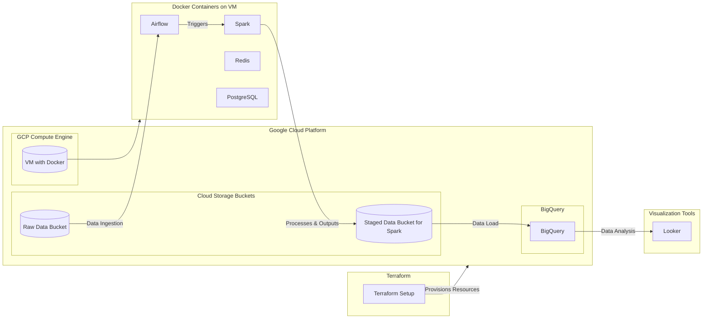

# README for Zoomcamp Engineering Data Pipeline Project
## Project Idea:
This project, part of the Zoomcamp Engineering curriculum, is designed to demonstrate an end-to-end data pipeline using various technologies on Google Cloud Platform (GCP). The project entails setting up an infrastructure to ingest, process, store, and visualize shipping data.

## Data:
The website https://web.ais.dk/aisdata/ is part of the Danish Maritime Authority's platform, providing AIS (Automatic Identification System) data. This AIS system collects and transmits data from ships, which is crucial for navigational safety and efficient maritime traffic management. The data includes real-time information about ship movements, including details such as ship type, position, course, and navigational status, among other information.

The Danish Maritime Authority offers both real-time and historical AIS data. Access to this data can help in monitoring ship traffic within Danish waters, offering an up-to-date view of the traffic situation. Typically, this data is used by various stakeholders in the maritime industry for safety, tracking, and operational efficiency purposes.

https://web.ais.dk/aisdata/!_README_information_CSV_files.


|     | Columns in *.csv file              | Format                                              |
|-----|------------------------------------|-----------------------------------------------------|
| 1.  | Timestamp                          | Timestamp from the AIS basestation, format: 31/12/2015 23:59:59 |
| 2.  | Type of mobile                     | Describes what type of target this message is received from (class A AIS Vessel, Class B AIS vessel, etc) |
| 3.  | MMSI                               | MMSI number of vessel                               |
| 4.  | Latitude                           | Latitude of message report (e.g. 57,8794)            |
| 5.  | Longitude                          | Longitude of message report (e.g. 17,9125)           |
| 6.  | Navigational status                | Navigational status from AIS message if available, e.g.: 'Engaged in fishing', 'Under way using engine', mv. |
| 7.  | ROT                                | Rot of turn from AIS message if available            |
| 8.  | SOG                                | Speed over ground from AIS message if available      |
| 9.  | COG                                | Course over ground from AIS message if available     |
| 10. | Heading                            | Heading from AIS message if available                |
| 11. | IMO                                | IMO number of the vessel                             |
| 12. | Callsign                           | Callsign of the vessel                               |
| 13. | Name                               | Name of the vessel                                   |
| 14. | Ship type                          | Describes the AIS ship type of this vessel           |
| 15. | Cargo type                         | Type of cargo from the AIS message                   |
| 16. | Width                              | Width of the vessel                                  |
| 17. | Length                             | Length of the vessel                                 |
| 18. | Type of position fixing device     | Type of positional fixing device from the AIS message|
| 19. | Draught                            | Draught field from AIS message                       |
| 20. | Destination                        | Destination from AIS message                         |
| 21. | ETA                                | Estimated Time of Arrival, if available              |
| 22. | Data source type                   | Data source type, e.g. AIS                           |
| 23. | Size A                             | Length from GPS to the bow                           |
| 24. | Size B                             | Length from GPS to the stern                         |
| 25. | Size C                             | Length from GPS to starboard side                    |
| 26. | Size D                             | Length from GPS to port side                         |

I used small sample based on one of archives. I believe, to copy directly from website, there slight modifications are needed, when reading with spark directly rchives, there is some problem with encoding, so it is adviced to extract archive into bucket and rename it.

## Main Components:
- Terraform: Used to provision and manage cloud infrastructure automatically.
- Docker: Containers
- Airflow: Orchestrates the workflow of data processing jobs.
- Spark: Processes large datasets efficiently.
- BigQuery: Acts as the data warehouse for analytics.
- Looker: For data visualization and analysis.

## Architecture:


### Architecture Zones and Flow:

- **Terraform**: Initializes and provisions all required Google Cloud Platform (GCP) resources.
- **Google Cloud Platform (GCP)**: This is the main cloud environment that hosts:
- **Cloud Storage Buckets**: Two buckets are used, one for raw data and another for staging data processed by Spark.
- **Compute Engine**: Hosts the virtual machine that runs Docker containers.
- **BigQuery**: Used as the data warehouse to store and analyze transformed data.
- **Docker Containers on VM**: Includes all key services running on the virtual machine:
- **Airflow**: Monitors the raw data bucket and orchestrates the workflow by triggering Spark jobs.
- **Spark**: Executes data processing jobs, transforming raw data and placing it into the staging bucket.
- **Redis & PostgreSQL**: Support services for Airflow, handling task queuing and metadata storage respectively.
- **Visualization Tools**: Data from BigQuery is visualized using Looker for dashboarding and analytical insights.

## Getting Started

1. **Create GCP Project**:
- Project Name: `ships-data-eda`

2. **Service Accounts and Permissions**:
- Add service account with admin level permissions for Compute, Storage, and BigQuery.

3. **Credentials**:
- Save JSON credentials at `gcp_creds/gcp-key.json`.

4. **Terraform Setup**:
- Use Terraform to create resources including 2 buckets, a dataset, and a VM.

5. **Verification**:
- Check that all resources have been created on the cloud.

## Configuration and Installation
1. **Connect to VM**:
- Set up SSH connection. Personal setup was VSCode via SSH.

2. **Installations on VM**:
```bash
# Update packages and install git
sudo apt-get update
sudo apt-get install git

# Clone the project repository
git clone [project]

# Some rearrangements
cd [project folder]
sudo mv * ../
cd ..
sudo rm -rf [project folder]/

# Installing docker-compose
sudo apt-get install docker-compose```

3. **Credentials Setup**:
    - Ensure JSON with credentials is located at `gcp_creds/gcp-key.json`.

## Firewall and Network Configuration

1. **Adjust Firewall Settings**:
    - Open ports for Airflow, Spark Master, and Spark Worker:
        - Airflow on port `8080`.
        - Spark Master on `tcp:8181`.
        - Spark Worker on `tcp:8081`.

## Docker and Airflow Setup

1. **Docker Compose**:
    
```bash
# Build the Docker images specified in Docker Compose file with environment variables passed
sudo -E docker-compose build

# Change the owner of Airflow directories to user with UID 50000
sudo chown -R 50000:50000 ./opt/airflow/dags ./opt/airflow/logs ./opt/airflow/plugins ./opt/airflow/config

# Initialize the Airflow database
sudo -E docker-compose run airflow-webserver airflow db init

# Create an Airflow user with administrative privileges
sudo -E docker-compose run airflow-webserver airflow users create \
        --username admin \
        --firstname ad \
        --lastname min \
        --role Admin \
        --email admin@admin.com

# Start all services defined in the Docker Compose file in detached mode
sudo -E docker-compose up -d

# List running Docker containers and check logs for the Airflow webserver
sudo docker ps
sudo docker-compose logs airflow-webserver 
```

    
2. **Configure Airflow**:
    
    - Open Airflow and add a GCP connection.
    - Configuration for Google Cloud with keyfile path at `/opt/bitnami/config/gcp-key.json`.
    - Add Spark connection with host `spark://spark-master` and port `7077`.
3. **Manual DAG Trigger**:
    
    - Manually start the DAG.

## Data Management

1. **Data Handling**:
    
    ```bash
    gcloud auth login 
    curl -L "https://raw.githubusercontent.com/aturevich/zoomcamp_de_project/files/small_test_data.csv" | gsutil cp - gs://$DATA_BUCKET_NAME/small_test_data.csv```
    
2. **BigQuery Checks**:
    
    - Check the table in BigQuery, ensure it is partitioned and clustered.
3. **Visualization and Export**:
    
    - Use Looker for dashboard viewing, though this was not the main focus.


